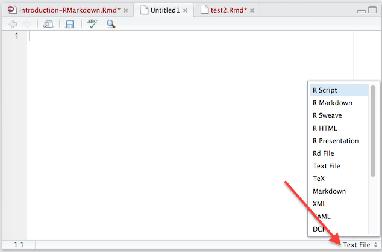
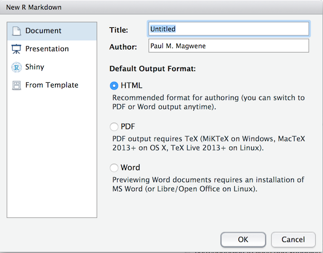

# Introduction

RStudio comes with a useful set of tools, collectively called R Markdown, for generating "literate" statistical analyses.  The idea behind literate statical computing is that we should try to carry out our analyses in a manner that is transparent, self-explanatory, and reproducible.   Literate staistical computing helps to ensure your research is reproducible because:

 1. The steps of your analyses are explicitly described, both as written text and the code and function calls used.
 2. Analyses can be more easily checked for correctness and reproduced from your literate code.
 3. Your literate code can serve as a template for future analyses, saving you time and the trouble of remembering all the gory details.

As we'll see, R Markdown will allow us to produce statistical documents that integrate  prose, code, figures, and nicely formatted mathematics so that we can share and explain our analyses to others.  Sometimes those "others" are advisors, supervisors, or collaborators; sometimes the other is you six months from now.  For the purposes of this class, you will be asked to complete problem sets in the form of R Markdown documents.

This hands-on provides a brief introduction to the capabilities of R Markdown.  For more complete details, including lots of examples, see the [R Markdown Website](http://rmarkdown.rstudio.com/index.html).


# Your First R Markdown Document

R Markdown documents are written in a light-weight markup language called Markdown.  Markdown provides simple plain text "formatting" commands for specifying the structured elements of a document. Markdown was invented as a lightweight markup language for creating web pages and blogs, and has been adopted to a variety of different purposes.  

We'll start off by creating a very simple R Markdown document. From the file
menu choose `File > New File > Text File`.

To tell RStudio to interpet this file as an R Markdown file, choose the file
type pop-up list from the lower right corner of the editor window (see figure 
below) and choose "R Markdown".



## A simple R Markdown document

Enter the following text in the editor window:

````
# Simple textual formatting 

This is a paragraph with plain text.  Nothing fancy will happen here.

This is a second paragraph with *italic*, **bold**, and `verbatim` text. 

# Lists

## Bullet points lists

This is a list with bullet points:

  * Item a
  * Item b
  * Item c

## Numbered lists
  
This is a numbered list:

  1. Item 1
  #. Item 2
  #. Item 3


# R code blocks

Now comes an R "code block". Everything between the matching sets of three
backward ticks (```) will be interpretted as R commands and evaluated by the
R interpretter:

```{r}
x <- rnorm(10) # generate ten random data points
y <- rnorm(10) # another ten random numbers
mean(x)
mean(y)
plot(x, y, col="red")
```

## Mathematics

We can include mathematical equations in a Markdown document by enclosing plain
text formulas in dollar signs. Here is an inline equation: $x^2 + y^2 = z^2$. 
And now comes a "displayed equation":
$$
\overline{x} = \frac{1}{n} \sum_{i=1}^{n} x
$$

````

## Compiling Markdown to HTML

Save your markdown  file as `first_example.Rmd` and compile it using the 
`Knit HTML` button at the top of the editor window.  This will produce the file 
"first_example.html" in your working directory, and pop up a new window in 
RStudio where you can view what the resulting HTML document looks like.


# Using the RStudio R Markdown default template

RStudio includes a dialog for creating basic templates for R Markdown documents.
From the File menu choose:

```
File > New File > R Markdown
```

From the R Markdown dialog box make sure the "Document" type is chosen in the list on the left, and choose "HTML" as the output format.  Give your document a meaningful title and then hit the "OK" button.



The standard template that RStudio creates for you includes a header section
like the following where you can specify document properties such as 
the title, author, and change the look and feel of the generated HTML document.

```
---
title: "Untitled"
author: "Paul M. Magwene"
date: "September 4, 2016"
output: 
  html_document:
    toc: true
    toc_depth: 2
    theme: readable
    highlight: default    
---
```

Following the header section there is a code chunk that you can use to set some
default behavior for evaluating code chunks.  For now, you can ignore this.

````
```{r setup, include=FALSE}
knitr::opts_chunk$set(echo = TRUE)
```
````

These header and the initial code chunk are followed by several example sections
that illustrate a few of the capabilities of R Markdown.  Delete these
and replace them with your own code as necessary.