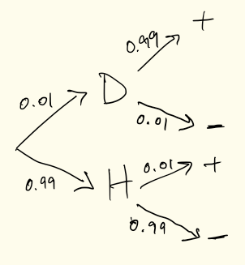

  
```{r setup, include=FALSE}
knitr::opts_chunk$set(echo = TRUE, prompt = FALSE, eval = TRUE, 
                      comment=NA, warning = FALSE, results="markup",
                      message = FALSE, cach = TRUE)
options(digits = 4)
```

# Bayes Theorem
There are a couple of equivalent ways to write Bayes theorem:

\[
P(B|A) = \frac{P(A|B)P(B)}{P(A)}
\]

and

\[
P(B|A) = \frac{P(A|B)P(B)}{P(A|B)P(B)+P(A|B^c)P(B^c)}
\]


# Example: Testing for a disease

This example is taken from a short article in Scientific American that provides a nice concise intro to Bayes Theorem:  https://www.scientificamerican.com/article/what-is-bayess-theorem-an/

## Single test

Q: A patient goes to see a doctor, who performs a diagnostic test for a disease of interest.  From CDC data the doctor knows that 1% of people in the patient population have the disease. The diagnostic test has sensitivity, $P(+|D)$, of 0.99 and a specificity of 0.99, $P(-|H)$, where $D$ and $H$ indicate the true state of the person being tested (i.e. has the disease or is healthy) and $+$ and $-$ indicate the result of the test.  If the patient tests positive ($+$), what is the probability that the patient actually has the disease?

A:  We're being asked to solve for $P(D|+)$, we're giving the conditional probability of getting a positive test, given that someone has the disease, $P(+|D)$ and the marginal probability of having the disease, $P(D)$, so we just need to calculate the marginal probability of getting a positive test, $P(+)$, before applying Bayes Theorem.


\begin{align}
P(+) & = P(D)P(+|D) + P(H)P(+|H) \\
     & = (0.01)(0.99) + (0.99)(0.01) \\
     & = 0.0198
\end{align}

Therefore, $P(D|+)$ can be calculated as:

\begin{align}
P(D|+) & = \frac{P(+|D)P(D)}{P(+)} \\
       & = \frac{(0.99)(0.01)}{0.0198} \\
       & = 0.50
\end{align}





## Two tests

Even a fairly sensitive and specific test doesn't provide definitive evidence that someone has a disease if the marginal probability is small.  One way to deal with that is to administer a second independent test if results come back positive.  In the real world, usually the initial test used is relatively quick and inexpensive, with a second "gold standard" (i.e. more expensive, more laborious) test being applied only if the first results were positive.  However, for the sake of simplicity let's assume that the first and second tests are independent but equally sensitive/specific.

Q:  What is the probability that the patient has the disease if the get positive results on two independent tests, $P(D|+_1+_2)$, where the subscripts indicate the results of each test?

A:  The marginal probability of the disease hasn't changed, so $P(D)$ stays the same.  However, to apply Bayes Theorem we have to calculate two new probabilities:

  1) The probability of getting two positive results given that you have the disease, $P(+_1+_2|D)$ 

\[
P(+_1+_2|D) = 0.99^2 = 0.9801
\]

  2) the marginal probability of getting two positive results,  $P(+_1+_2)$
  
\begin{align}
P(+_1+_2) & = P(D)P(+_1|D)P(+_2|D) + P(H)P(+_1|H)P(+_2|H) \\
          & = (0.01)(0.99)(0.99) + (0.99)(0.01)(0.01) \\ 
          & = 0.0099
\end{align}


Given the above, we can then calculate $P(D|+_1+_2)$ as follows:

\begin{align}
P(D|+_1+_2) & = \frac{P(+_1+_2|D)P(D)}{P(+_1+_2)} \\
            & = \frac{(0.9801)(0.01)}{0.0099} \\
            & = 0.99
\end{align}

A second positive result using an independent test gives us a lot more confidence that our patient actually has the disease.


