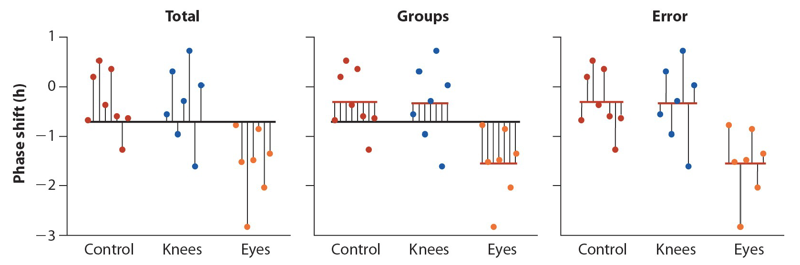
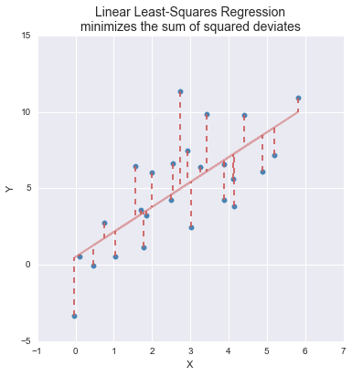

  
```{r setup, include=FALSE}
knitr::opts_chunk$set(echo = TRUE, prompt = FALSE, eval = TRUE, 
                      comment=NA, warning = FALSE, results="markup",
                      message = FALSE, cache = FALSE)
options(digits = 4)
```


# Review: ANOVA as Partitioning of Sum of Squares

In last lecture we discussed how analysis of variance (ANOVA) can be thought of as a partitioning of the sum-of-squared deviations, into that portion attributable to the group (treatment) effect and a portion attributable to a error (within-group) effect:

\[
SS_{\text{total}} = SS_{\text{group}} + SS_{\text{error}}
\]

And here's a visual representation we looked at in the last lecture.



# Review: Least Squares Regression

Recall that when we fit a least square linear regression of $Y$ on $X$ we are trying to find a linear function of $X$ of the form:

\[
 f(X) = bX + a
\]

where $b$ is the slope and $a$ is the intercept, that minimizes the quantity:

\[
\sum_{i=1}^{n} (Y_i - f(X_i))^2
\]



Our goal is to find the linear function of $X$ that minimizes the **squared deviations** of the observed $Y$ values from the linear model prediction.  Another way to state this is that we're trying to finding the linear function of $X$ that minimizes the sum-of-squared residuals from the regression model.  

In parallel to the partitioning we discussed for ANOVA, linear least squares regression can also be interpretted as a sum-of-squares partitioning:

\[
SS_{\text{total}} = SS_{\text{regression}} + SS_{\text{residual}}
\]

# Example data: Lion age predicted from facial pigmentation

To illustrate our linear regression calculations we'll use a data set from a study of African lions.  A study by Whitman et al. (2004) showed thte amount of black coloring on the nose of male lions increases with age, and suggested that this might be used to estimate the age of unknown lions.  The lion data set is available at this link [lion-noses.csv](https://github.com/Bio204-class/Bio204-Fall-2016/raw/master/datasets/lion-noses.csv) , and the bivariate relationship between age and proportion of black pigmentation looks like this:

```{r}
library(ggplot2)
theme_set(theme_classic())

# load data
lions <- read.csv("https://github.com/Bio204-class/Bio204-Fall-2016/raw/master/datasets/lion-noses.csv")

# plot data
lions.plot <- ggplot(lions, aes(x = proportionBlack, y = ageInYears)) + 
  geom_point(color="red", size = 2) +
  labs(x = "Proportion black", y = "Age (years)")
```

## Fitting the regression model in R

Fitting linear regression models in R is simple using the `lm` function, and we can generate summary summary statistics by applying the `summary` function to the object returned by `lm`:

```{r}
lm.lions <- lm(ageInYears ~ proportionBlack, lions)
summary(lm.lions)
```

## Plotting the regression fit using ggplot

To plot the regression model in ggplot we can add a call to the `geom_smooth` geom:

```{r}
lions.plot + geom_smooth(method = lm, se = FALSE)
```


# Variance "explained" by a regression model

We can  use the sum-of-square decomposition to understand the relative proportion of variance "explained" (accounted for) by the regression model.

We call this quantity the "Coefficient of Determination",  designated $R^2$.  

\[
R^2 = \frac{SS_\text{regression}}{SS_\text{total}} = \left( 1 - \frac{SS_\text{residuals}}{SS_\text{total}} \right)
\]

The coefficient of determination is also useful in the context of ANOVA.

We can extract the coefficient of determination from the summary as follows:

```{r}
summary(lm.lions)$r.squared
```


# Variance of the Model and Residuals

In the same way that we calculated the group mean square ($MS_\text{group}$) and error mean square ($MS_\text{error}$) in ANOVA, we can calculate a model mean square ($MS_\text{regression}$) and residual mean square ($MS_\text{residual}$) as follows:

\[
MS_\text{regression} =\frac{SS_\text{regression}}{df_\text{regression}} = \sum_i(\hat{Y}_i - \bar{Y})^2
\]

In bivariate regression, the regression degrees of freedom, $df_\text{regression} = 1$.

The residual mean square is given by:

\[
MS_\text{residual} =\frac{SS_\text{residual}}{df_\text{residual}} = \frac{\sum_i(Y_i - \hat{Y}_i)^2}{n-2}
\]

where $df_\text{residual} = n - 2$.

# Using an ANOVA table to summarize a regression model

We can organize tthe sum of squares and mean squares terms for the regression model in an ANOVA table:

| Sources of variation | Sum of squares | df | Mean squares | F-ratio |
| :------------------- | :------------- | :-: | :----------: | :-----: |
| Regression           | $SS_\text{regression} = \sum_i(\hat{Y}_i - \bar{Y})^2$ | 1 | $\frac{SS_\text{regression}}{df_\text{regression}}$ | $\frac{MS_\text{regression}}{MS_\text{residual}}$ |
| Residual             | $SS_\text{residual} = \sum_i(Y_i - \hat{Y}_i)^2$ | n-2 | $\frac{SS_\text{residual}}{df_\text{residual}}$ |  |
| Total                | $SS_\text{total}$ | n-1 |  |  |


The calculated F-ratio can be compared to the corresponding F distribution, $F_{1,n-2}$, to test the null hypothesis that the slop of the regression equals zero.

## Generating an ANOVA table from a regression model in R

To get an ANOVA table from a regression fit by `lm` we can simply apply the `anova` function to the linear model object as shown below:

```{r}
anova(lm.lions)
```


# Standard error of the regression slope and intercept

Like all the other statistical estimators we've looked at over the course of the semester, there is uncertainty associated with the sample estimate of the slope $b$, which is an estimate of an underlying population slope $\beta$. The standard error of $b$ is given by:

\[
SE_b = \sqrt{\frac{MS_\text{residual}}{\sum_i(X_i - \bar{X})^2}}
\]

and the standard error of the intercept $a$ is given by:

\[
SE_a = \sqrt{MS_\text{residual}\left(\frac{1}{n} + \frac{\bar{X}^2}{\sum_i(X_i - \bar{X})^2}\right)}
\]

Standard errors of the slope and intercept are available from the `summary` function.

# t-test of regression slope

To test a null hypothesis about the population slope, $H_0: \beta = \beta_{0}$, we can calculate a t-statistic:

\[
t = \frac{b - B_{H_0}}{SE_b}
\]

and compare the test statistic to the t-distribution with $n-2$ degrees of freedom to estimate a p-value. This information is available from the `summary` function.

# Confidence interval for the regression slope

Confidence intervals for the regression slope are given by:

\[
b \pm t_{\alpha(2),n-2}\ SE_b
\]

where $SE_b$ is the standard error of the regression slope as defined above, and $t_{\alpha(2),n-2}$ is the two-tailed critical value of the t-distribution with $df = n-2$.

# Confidence bands for the regression

Regression confidence bands are used to express our uncertainty about the predicted *mean Y* for a given value of X.  To do this we need to account for uncertainty both in the estimated slope and the intercept.  The confidence interval for $\hat{Y}_i$ at a given value, $X_i$, is:

\[
\hat{Y}_i \pm t_{\alpha(2),n-2}\ SE[\hat{Y}]
\]

where 

\[
SE[\hat{Y}] = \sqrt{MS_\text{residual}\left(\frac{1}{n} + \frac{(X_i - \bar{X})^2}{\sum_i(X_i - \bar{X})^2}\right)}
\]

## Drawing regression confidence bands in ggplot

We can change the `se` argument of `geom_smooth` to draw confidence bands for the regression.

```{r}
lions.plot + geom_smooth(method = lm, se = TRUE)
```


