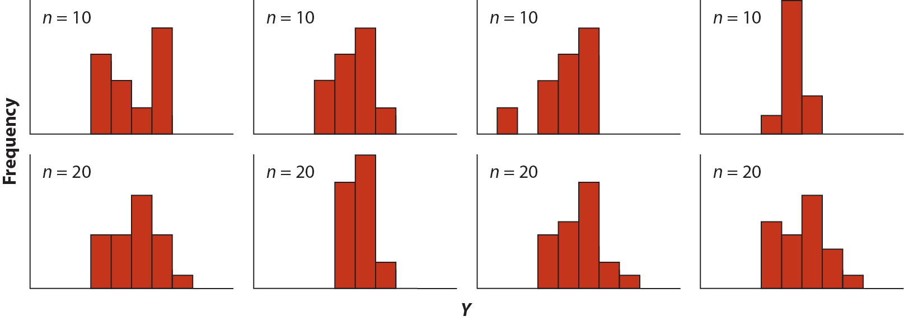
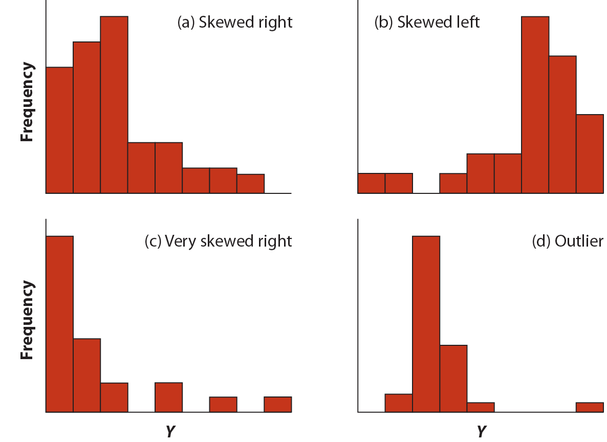
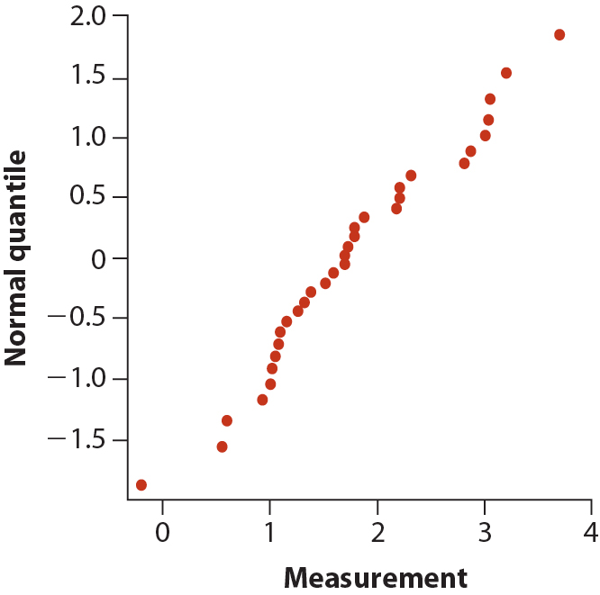
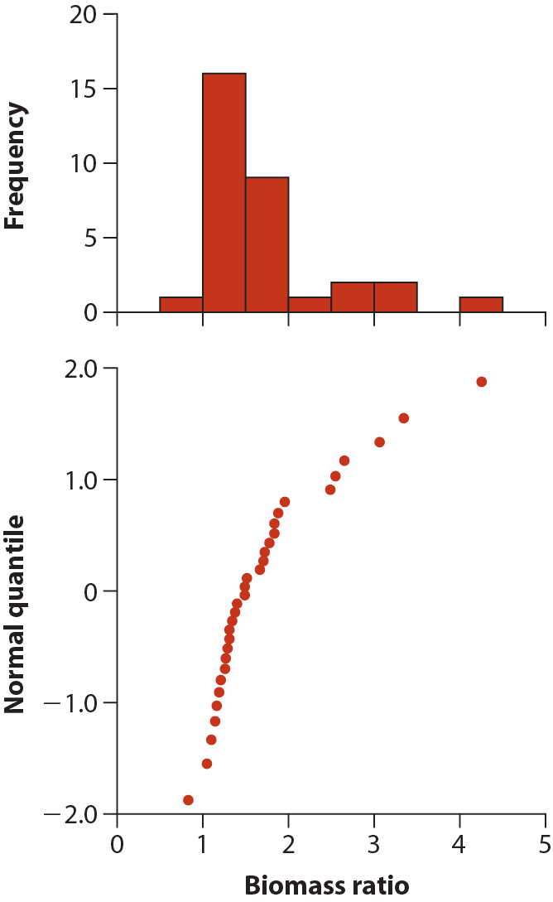
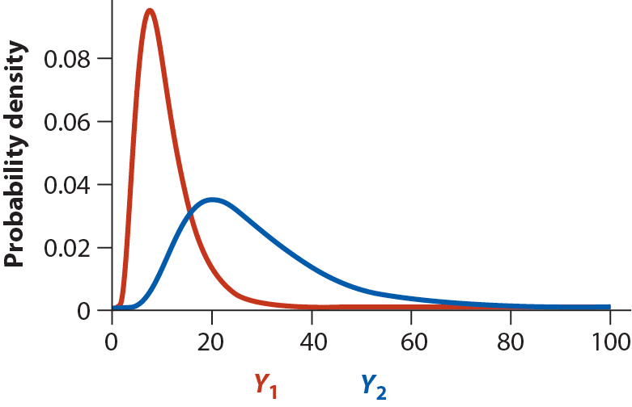
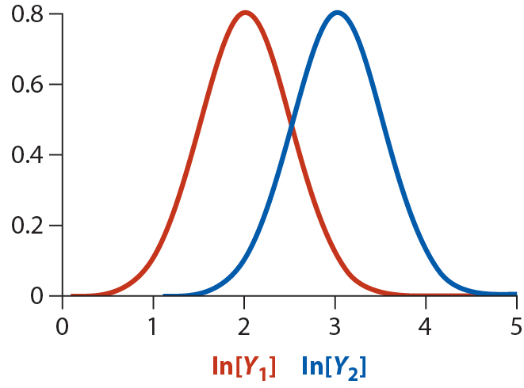

---
title: |
  Data transformations and\
  Non-Parameteric Methods
author: Paul M. Magwene
date:   07 December 2016
...

# What do you do if your data is not normally distributed?

## Is my data normally distributed?

## Some non-normal distributions

## Visual tools: normal quantile plot

{height=2in}

R functions:

 - `qqplot` and `qqline`, set argument `datax=TRUE` to plot observed data on x-axis like in figure above

## Example data set: Comparing biomass between protected and unprotected marine sites

from Whitlock and Schluter:

 - Halpern (2003) posed the equstion: Aare reserves effective in preserving marine wildlife?
 - Compared biomass in each of 32 marine reserves to control (non-reserve) locations
 - Calculate a "biomass ratio" as total mass of all marine plants and animals per unit area of reserve dividided by same quantity in unprotected control
 
 Null and alternative hypotheses

  - $H_0$: the mean biomass ratio is unaffected by reserve protection ($\mu = 1$)
  - $H_A$: the mean biomass ratio is affected by reserve protection ($\mu \neq 1$)

## Histogram and Normal quantile plot of biomass data

## A formal test for normality: Shapiro-Wilk Test

Essentially a regression of ordered sample values on corresponding expected normal order statistics.

 * $H_0$: the observed data is drawn from a population with normally distributed values
 * $H_A$: the observed data is a drawn from a population where distribution is not normal

Compare Shapiro-Wilk test statistics to expected sampling distribution under $H_0$.

 * P-value < significance threshold, $\alpha \rightarrow$ evidence reject null hypothesis

R function:

 * `shapiro.test`

# Data transformations

A number of mathematical transformations can sometimes help to make data more approximately normal

 1. Log transformation
 #. Arcsine transformation
 #. Square root transformation
 #. Square transformation
 #. Natural exponential transformation
 #. Reciprocal transformation

## Log transformation

$$X' = \ln[X]$$

Tends to work well when:

 - The data are all positive
 - The frequency distribution is right skewed
 - The data span several orders of magnitude
 - The measurements are ratios or products of variables
 - e.g. morphological measures such as body mass, length

## Log transformation, cont.

{height=1.5in}\ {height=1.5in}

## Generate log transformation of biomass ratio data set

## Cautions re: Log transformation

- $\bar{X'} \neq \ln[\bar{X}]$
- Often will do analyses in log transformed data, and then back transform to original scale to report *geometric mean*  and CIs to facilitate interpretation

## Arcsine transformation

$$
X' = arcsin[\sqrt{X}]
$$

 - Used when data are proportions
 - Values must be in range 0-1, divide by 100 if working with percentages

Example:
 
 * Average percent of Senecio integrifolius flowers producing seeds at six different field sites (Widen 1993):  29.8, 44.2, 58.3, 83.0, 78.2, 72

## Other transformations

Square-root transformation, $X'  = \sqrt{X + 1/2}$

 - Used for count data (number of eggs laid, number of bacterial colonies, etc)

Square transformation, $X' = X^2$

 - left skewed data

Natural exponential function, $X' = e^{X}$

 - alternative for left skewed data

Reciprocal transformation, $X' = \frac{1}{X}$

 - right skewed, all data points have the same sign

# Non-parametric tests

## Sign test (alternative to one-sample t-test)

 * Non-parameteric alternative to one-sample t-test
 * Tests whether median of a population equals a null hypothesized value
 * not very well powered

R implementation

 * can be done as a binomial test or using `signmedian.test` package

## Example data set, Cricket sexual cannabilism

* Sage crickets, *Cyphoderris strepitans*, have unusual mating system. During mating, male offers his fleshy hind wings to female to eat.  Females thus get nutrition during mating. Question: Are females more likely to mate if they are hungy?

* Data set (`SagebrushCrickets.csv`) compares time to mating (in hours) between starved and fed crickets

## Mann-Whitney U-test (alternative to two-sample t-test)

 * Non-parameteric alternative to two-sample t-test
 * Basic algorithm
   - combine data from both groups rank all data from smallest to largest 
   - Calculate a teset statistic, U, which is based on sum of ranks for each group
   - Compare observed U statistic to sampling distribution of U under null hypothesis of no difference in ranks between groups
   - Equivalent to a test called "Wilcoxon rank-sum test"

R implementation

 - `wilcox.test`

## Kruskal-Wallis test (alternative to ANOVA)

 * Non parametric alternative to ANOVA
 * Tests  for differences in medians of distributions for $k$ groups
 * Equivalent of Mann-Whitney U Test for more than two groups
 * Rank observations, use sum of ranks in different groups as test statistic

R implementation

- `kruskal.test`

## Spearman's rank correlation 

 * Non-parametric method to Pearson's product moment correlation
 * Specify `method = "spearman"` in `cor` function

## Power of non-parametric tests

 * Generall less powered than parametric tests because based on less information (e.g. ranks only, ignoring magnitudes)

 * Have little power when sample sizes are small (e.g. <5)